# CDC-Based Incremental Data Pipeline on Azure
This project demonstrates a CDC (Change Data Capture) ingestion and transformation pipeline for Airbnb data using Azure Data Lake Storage (ADLS), Azure CosmosDB, Azure Data Factory (ADF), and Azure Synapse Analytics. It automates periodic ingestion of Airbnb customer data and real-time processing of booking events via CosmosDB Change Feeds. Transformed data is upserted into target tables in Synapse, enabling a scalable and fully automated data flow architecture.

# Data Architecture

Below is the architecture diagram showcasing how data flows through the different components:

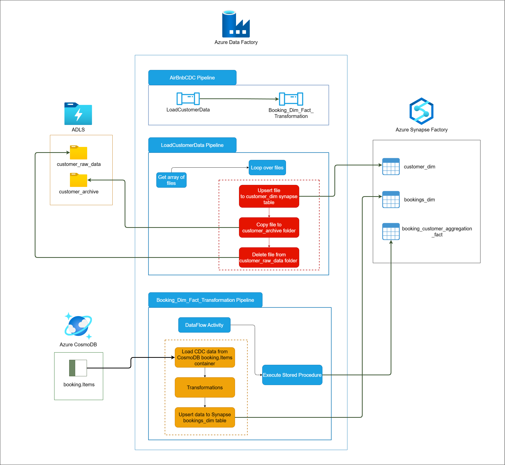

---

## Table of Contents

- [AirBnB CDC Ingestion Pipeline](#airbnb-cdc-ingestion-pipeline)
  - [Table of Contents](#table-of-contents)
  - [Tech Stack](#tech-stack)
  - [SQL Files for Table Creation](#sql-files-for-table-creation)
  - [Pipeline Features](#pipeline-features)
  - [LoadCustomerDim Pipeline](#loadcustomerdim-pipeline)
    - [Pipeline Activities](#pipeline-activities)
      - [1. Get Metadata of Files](#1-get-metadata-of-files)
      - [2. Process Each File](#2-process-each-file)
  - [Booking\_Dim\_Fact\_Transformation Pipeline](#booking_dim_fact_transformation-pipeline)
    - [Pipeline Activities](#pipeline-activities-1)
      - [1. Data Flow Activity](#1-data-flow-activity)
        - [1. Sources](#1-sources)
        - [2. Transformations](#2-transformations)
        - [3. Sinks](#3-sinks)
      - [2. Stored Procedure Activity](#2-stored-procedure-activity)
        - [Stored Procedure Execution](#stored-procedure-execution)
        - [Stored Procedure Logic](#stored-procedure-logic)
  - [Outputs](#outputs)
  - [Conclusion](#conclusion)

---

## Tech Stack

- **Azure Data Factory (ADF)**: Orchestration of pipelines for data movement and transformations.
- **Azure Data Lake Storage (ADLS)**: Storage for raw and archived data.
- **Azure Synapse Analytics**: Data warehouse for analytical queries.
- **Azure Cosmos DB for NoSQL**: Source of change data for booking events.
- **Python**: Custom data generation scripts.
- **T-SQL**: Database and transformation logic.

---

## SQL Files for Table Creation

The SQL files for creating the tables in the **Synapse SQL Pool** can be found in the following locations:

1. **Customer Dimension Table**:
    - [customer_dim.sql](./scripts/sql/tables/create_customer_dim.sql)

2. **Bookings Dimension Table**:
    - [bookings_dim.sql](./scripts/sql/tables/create_bookings_dim.sql)

3. **Booking Customer Aggregation Fact Table**:
    - [booking_customer_aggregation_fact.sql](./scripts/sql/tables/create_booking_customer_aggregation_fact.sql)

---

## Pipeline Features

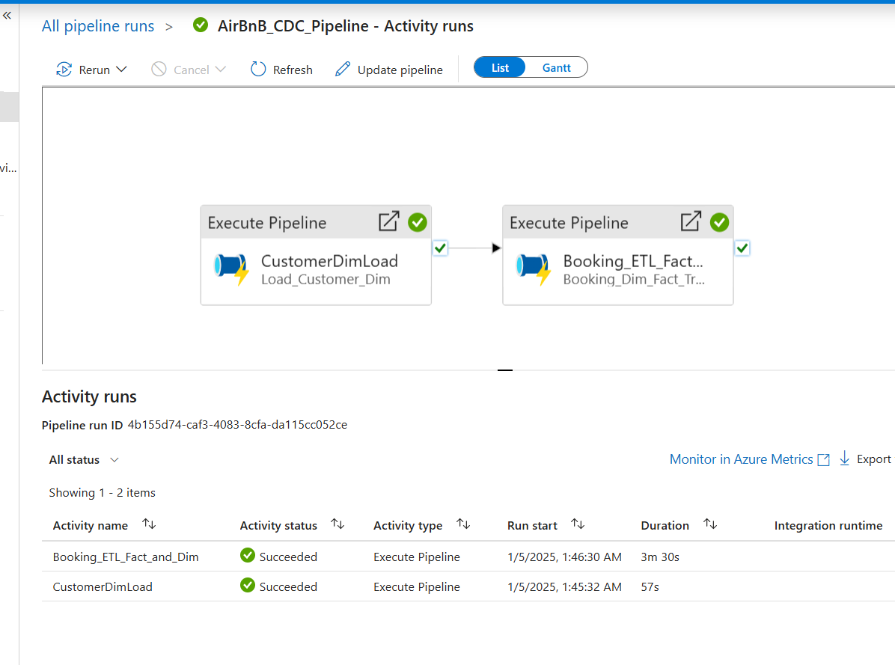

1. **Hourly SCD-1 Updates**:
   - Reads customer data from **ADLS** every hour.
   - Performs **Slowly Changing Dimension Type 1 (SCD-1)** updates on the `customer_dim` table in **Synapse Analytics**, ensuring that the customer data is always up-to-date.

2. **Change Data Capture (CDC)**:
   - Captures incremental booking events from **CosmosDB** using **change feeds**.
   - Processes these events in **Azure Data Factory (ADF)**, performs necessary transformations, and upserts the resulting data into **Synapse**.

3. **Automated Workflows**:
   - Configures triggers and dependencies in ADF to automate the entire process, ensuring seamless and continuous data flow.

---

**AirBnB CDC Pipeline Configuration File**

You can find the JSON configuration file for this pipeline here:  
[AirBnBCDCPipeline.json](./pipelines/AirBnBCDCPipeline.json)

---

## LoadCustomerDim Pipeline

The **LoadCustomerDim** pipeline implements Change Data Capture (CDC) to process customer data. It retrieves raw customer files from **Azure Data Lake Storage (ADLS)**, applies transformations, and updates the **airbnb.customer_dim** in **Azure Synapse Analytics**. The pipeline also manages raw data file archiving and cleanup to maintain an organized data lake.

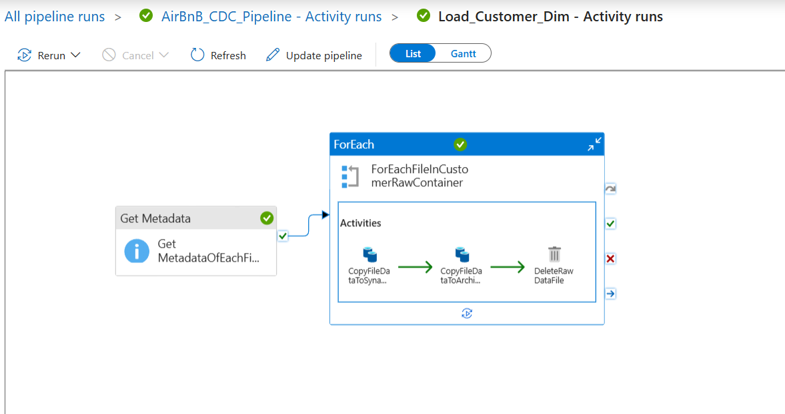

---

### Pipeline Activities

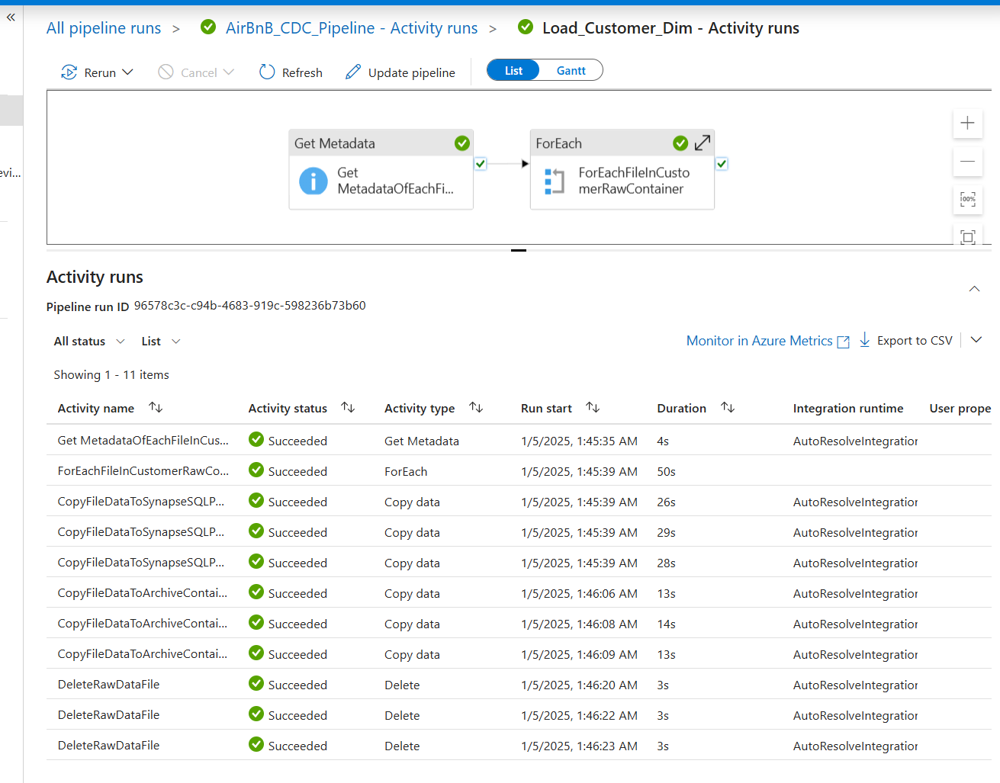

#### 1. Get Metadata of Files

**Activity Name:** `Get MetadataOfEachFileInCustomerRawDataContainer`

- Retrieves metadata for each file in the **customer_raw_data** folder on ADLS.
- This metadata is used to identify the files to be processed in the subsequent activity.
- All the input CSV files are uploaded in the datasets folder here - [Customer Data](./datasets/customer_data)

---

#### 2. Process Each File

**Activity Name:** `ForEachFileInCustomerRawContainer`

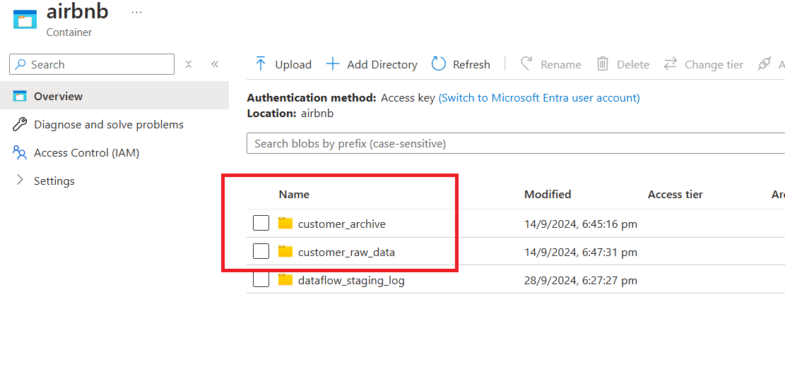

This activity iterates over each raw customer file identified in the previous step and performs the following sub-steps:

1. **Copy File Data to Synapse SQL Pool**  
   - **Purpose:** Transfers raw customer data to the **airbnb.customer_dim** table in **Azure Synapse Analytics**.  
   - **Method:** Performs an **Upsert** operation using the `customer_id` as the primary key.  
   - **Format:** Source files are in DelimitedText format.

2. **Archive Processed Files**  
   - **Purpose:** Moves successfully processed files from the **customer_raw_data** folder to the **customer_archive** folder.  
   - **Benefit:** Ensures raw files are preserved for future reference while maintaining a clean source folder.

3. **Delete Raw Files**  
   - **Purpose:** Deletes raw files from the **customer_raw_data** folder after successful archiving.  
   - **Benefit:** Prevents duplicate processing and optimizes storage space in the data lake.

---

**LoadCustomerDim Pipeline Configuration File**

You can find the JSON configuration file for this pipeline here:  
[LoadCustomerDimData.json](./pipelines/LoadCustomerDimData.json)

---

## Booking_Dim_Fact_Transformation Pipeline

The **Booking_Dim_Fact_Transformation** pipeline performs several data transformations to update the **airbnb.bookings_dim** table in **Azure Synapse**. It uses data from **CosmosDB** and **Synapse SQL Pool** for enriching and updating booking data.

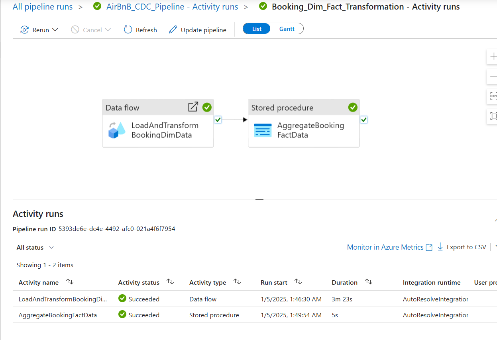

---

### Pipeline Activities

#### 1. Data Flow Activity

This activity uses **Azure Data Factory Data Flow** to transform the raw booking data. It performs several transformations and enrichment on the data before it is written to the **airbnb.bookings_dim** table in **Azure Synapse**.

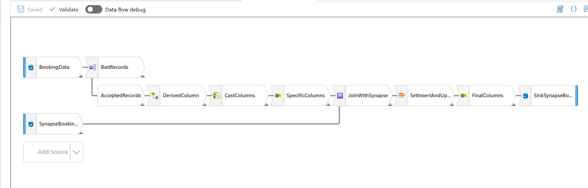

This Mapping Data Flow processes the booking records from **Azure Cosmos DB** and writes the transformed data to the **Bookings Dimension Table** in **Azure Synapse SQL Pool**.

##### 1. Sources

- **CosmosDBBookingDataset**: A dataset representing the source of the booking data in **Cosmos DB**.

  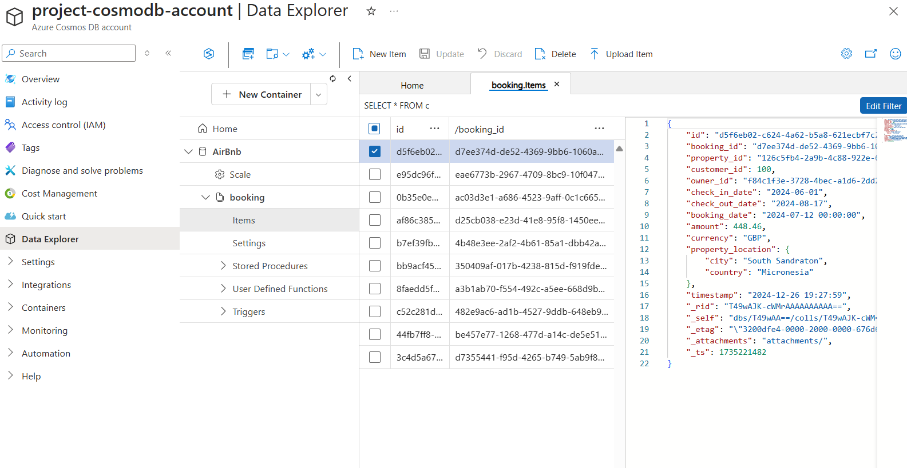

- The Python script generates booking data for CosmosDB, simulating real-time insertion with a delay between each record. The script sets up the CosmosDB client, creating the database and container, generating data using Faker, and inserting each booking record. Reference to the script file - [cosmodb_generate_mock_data.py](./scripts/data_generation/cosmodb_generate_mock_data.py)

- **SynapseSQLPoolBookingsDimTable**: The dataset representing the destination table in **Azure Synapse SQL Pool**, where the transformed data is written.

##### 2. Transformations

   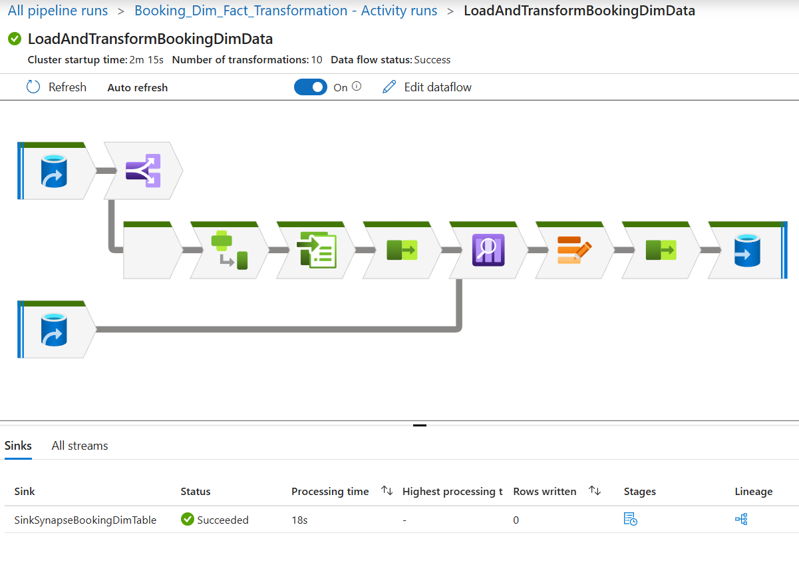
- **DataQualityCheck**: 
  - Validates the incoming data and splits records into `BadRecords` and `AcceptedRecords` based on whether the `check_out_date` is later than the `check_in_date`

- **DerivedColumn**:
  - Creates new columns for the records such as:
    - **stay_duration**: Calculated as the difference between `check_out_date` and `check_in_date`.
    - **booking_year** and **booking_month**: Extracted from the `booking_date`.
    - **full_address**: A concatenation of the `city` and `country`.
    - Other necessary fields like `booking_id`, `amount`, `currency`, etc.

- **JoinWithSynapse**:
  - Performs a lookup to join incoming records with existing data in the **Synapse bookings_dim Table** based on the `booking_id`. This is to identify new or updated records.

- **SetInsertAndUpdateAlterRowPolicies**:
  - Determines whether the record should be inserted or updated based on the existence of `booking_id` in the **Synapse Booking Dim Table**.

- **CastColumns**:
  - Casts the data to the appropriate types for the destination table in Synapse.

- **SpecificColumns**:
  - Filters out unnecessary columns, ensuring that only required columns are passed along for further processing.

- **FinalColumns**:
  - Finalizes the columns to match the destination schema and handles the data before it is written to the Synapse SQL pool.

##### 3. Sinks

- **SinkSynapseBookingDimTable**: This is the final sink where processed booking data is inserted into the **Synapse SQL Pool** table.

  The JSON configuration file for this dataflow can be found here:  
[ETL_BookingDimData.json](./dataflows/ETL_BookingDimData.json)

---

#### 2. Stored Procedure Activity

After the data flow activity completes successfully, the **AggregateBookingFactData** activity calls a stored procedure to aggregate the transformed booking data. This stored procedure updates the **airbnb.booking_customer_aggregation_fact** table, which contains aggregated data at the customer level.

##### Stored Procedure Execution

- **Stored Procedure Name**: `[airbnb].[sp_aggregate_booking_data]`  
- **Linked Service**: Azure Synapse Analytics  
- **Dependency**: Depends on the successful completion of the previous data flow activity.  
- **Timeout and Retry**: Timeout of 12 hours and 0 retries if it fails.

##### Stored Procedure Logic

1. **Truncates** the **airbnb.booking_customer_aggregation_fact** table to remove outdated data.  
2. **Aggregates** booking data from the **airbnb.bookings_dim** table by joining with the **airbnb.customer_dim** table. It calculates:  
   - `total_bookings`: The count of bookings per country.  
   - `total_amount`: The sum of booking amounts for each country.  
   - `last_booking_date`: The latest booking date per country.  
3. **Inserts** the aggregated results back into the **airbnb.booking_customer_aggregation_fact** table.

The SQL script for the stored procedure can be found here:  
[sp_aggregate_booking_data.sql.sql](./scripts/sql/stored_procedures/sp_aggregate_booking_data.sql)

---

**Booking_Dim_Fact_Transformation Pipeline Configuration File**

You can find the JSON configuration file for this pipeline here:  
[BookingDimFactTransformation.json](./pipelines/BookingDimFactTransformation.json)

---

## Outputs

The following tables are created and populated in **Azure Synapse SQL Pool** as part of the ETL process:

1. **Customer Dimension Table**:
    - This table contains data related to customers, such as their demographics and history.

    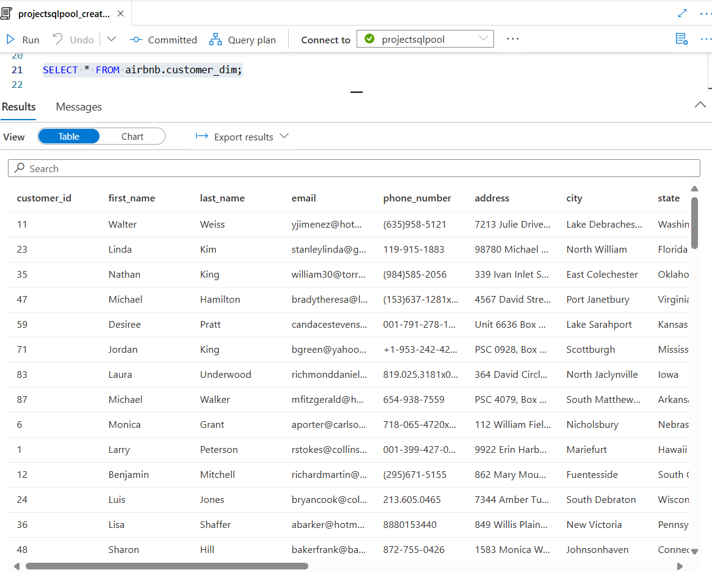
    - The output **CSV** for the **Customer Dimension Table** can be accessed via the link below:
      - [Customer Dimension Table CSV](./output/airbnb.customer_dim.csv)

2. **Bookings Dimension Table**:
    - This table contains the transformed booking data.

    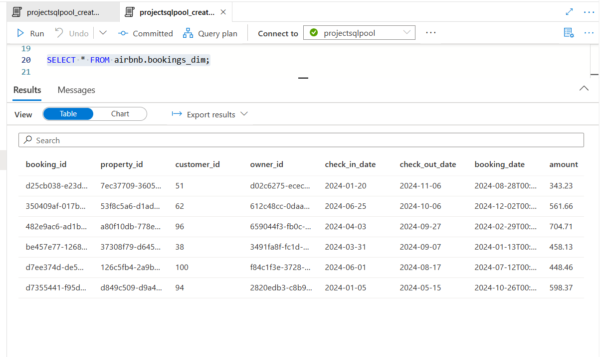
    - The output **CSV** for the **Bookings Dimension Table** can be accessed via the link below:
      - [Bookings Dimension Table CSV](./output/airbnb.bookings_data.csv)

3. **Booking Customer Aggregation Fact Table**:
    - This table stores aggregated booking data and insights.

    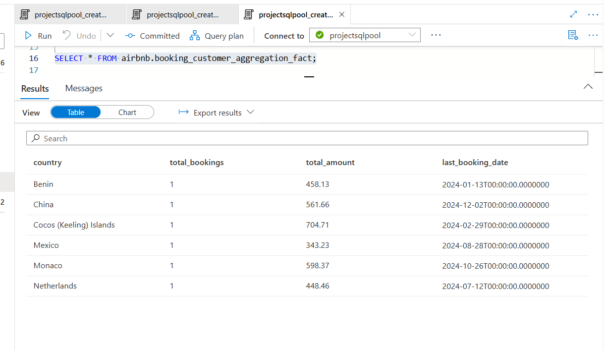
    - The output **CSV** for the **Booking Customer Aggregation Fact Table** can be accessed via the link below:
      - [Booking Customer Aggregation Fact Table CSV](./output/airbnb.booking_customer_aggregation_fact.csv)

---

## Conclusion

The **AirBnB CDC Ingestion Pipeline** pipeline offers a robust, automated solution for managing and processing large volumes of data related to AirBnB bookings. By leveraging Azure’s powerful services such as Data Factory, Synapse Analytics, and CosmosDB, the pipeline ensures data is processed efficiently, providing analytical and reporting insights into booking and customer behavior.

---

## Learnings

- Built a CDC-based data pipeline using ADF, CosmosDB, ADLS, and Synapse
- Configured CosmosDB Change Feed for real-time booking data ingestion
- Orchestrated data workflows and transformations with ADF pipelines and data flows
- Performed data upserts into Synapse using T-SQL and ADF
- Designed a scalable, automated ingestion pipeline on Azure

### 🔗 Connect With Me

- [LinkedIn](https://www.linkedin.com/in/ishantkumar091)

🏷️ Tags #Azure #DataFactory #SynapseAnalytics #CosmosDB #ADLS #CDC #DataPipeline #RealTimeIngestion #AzureAnalytics #DataEngineering #TSQL #CloudAutomation #AzureDataPlatform #StreamingData #ETL #Serverless #Automation #ChangeDataCapture

